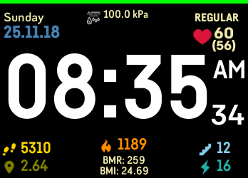
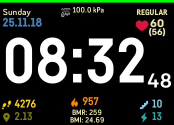
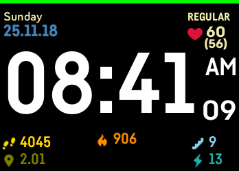
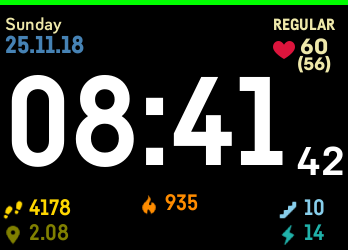
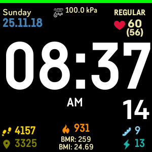
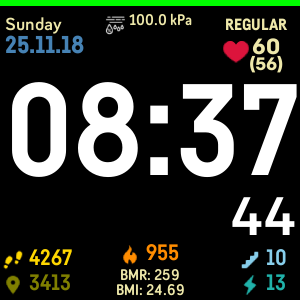
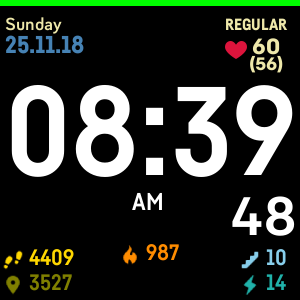
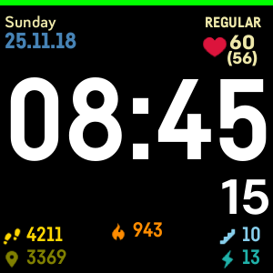

Also check out AND v1 if you want activities with progress =>  `https://github.com/ahsandar/ANDv1`

Power user mode and Minimal mode available

12/24hr support  available. Date is day ,date month and year.

The Battery is a bar at the top, changes colour for every 25% increment/decrement.

Activity for steps, distance, elevation, calories active minutes is visible.

The heart rate has active and resting hear rate with heart rate zone at the top.
Heart Rate Zone visibility can be toggled

The basal metabolic rate and BMI is displayed under calorie count
BMI. BMR visibitly can be changed

Barometer reading from the sensor added for display in kPa. Barometer reading  visibility can be changed

---

 
 
 
 

---

 
 
 
 